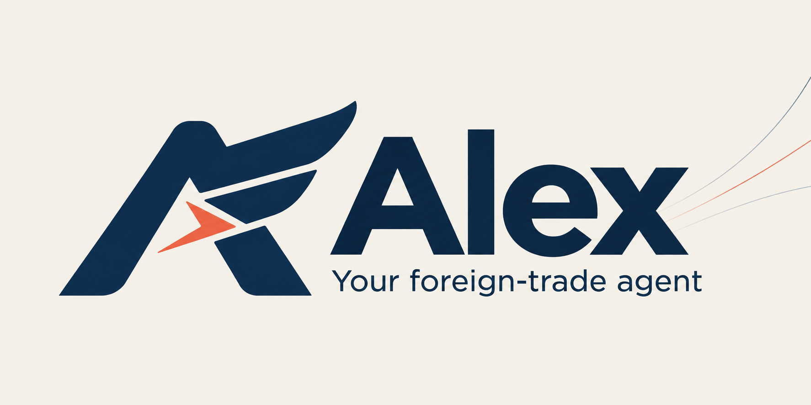
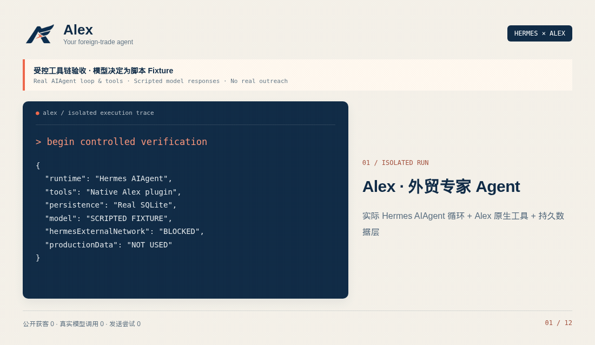

<p align="center"></p>

# Alex · 外贸专家 Agent

**了解你的产品，研究真实买家，记住每次交流，持续推进客户开发。**

Alex 基于 [Hermes Agent](https://github.com/NousResearch/hermes-agent) 的执行内核，提供独立的外贸身份、行业技能、长期业务记忆、真实浏览器研究和客户沟通工具。你在对话中交代目标，Alex 使用工具执行、保存证据和进度，再根据结果继续工作。

**v0.3 · Hermes profile distribution · 24 项领域工具 · 本机持久数据 · MIT**

[启动 Agent](docs/alex-agent.md) · [邮箱与 WhatsApp](docs/alex-channels.md) · [Hermes 源码研究](docs/alex-hermes-study.md) · [验收记录](docs/alex-acceptance.md) · [后续路线](ROADMAP.md)



动图展示实际 Hermes 工具循环、Alex API 与 SQLite 的执行记录。模型决定使用明确标注的脚本 fixture：两次进程共 10 次真实工具调用，验证业务记忆、重启恢复、草稿去重与默认拒绝外发。真实模型调用、公开获客和发送均为 0。[查看完整记录](docs/assets/alex-agent-demo-manifest.json)。

## 它怎样工作

首次交流，Alex 先读取已有资料，再了解产品、目标市场和买家类型。产品优势、认证、交期、渠道偏好等用户明确提供的事实会保存下来，下次会话继续使用。

研究任务由 Agent 分析条件，调用真实 Chromium 访问网页，保存公司、公开联系方式、来源原文和任务检查点。重复研究复用客户身份；中断后可以继续原任务。

接入 Gmail 后，Alex 可以查询邮件、阅读回复并准备开发信。Gmail、WhatsApp 和 WhatsApp Cloud 的外发经过本机收件人策略与通信记录：保存正文、执行发送、记录服务商消息 ID、处理退订，避免不确定状态下重复发送。实际能力与连接步骤见[渠道说明](docs/alex-channels.md)。

| Alex 的组成 | 职责 |
| --- | --- |
| Hermes 执行内核 | 模型与工具循环、上下文、会话、记忆、技能、网关和定时运行基础 |
| Alex 身份与技能 | 产品访谈、市场与买家研究、证据判断、开发沟通与跟进 |
| Alex 领域工具 | 业务资料、客户、证据、浏览器、研究任务、邮箱与通信记录 |
| 本机数据 | Alex SQLite 保存客户与来源；独立 profile 保存 Agent 会话与记忆；通信账本保存尝试与退订 |
| 可选管理页面 | 查看客户、证据和任务，必要时接管浏览器 |

## 启动

准备已安装的 [Hermes](https://github.com/NousResearch/hermes-agent)、Node.js **24.5+** 和 Chromium。Alex 业务服务使用 Linux / WSL2 的 `flock`。Windows 可以使用原生 Hermes + WSL2 业务服务。

```bash
npm ci
npm run doctor
npm start
```

在另一个终端配置业务服务令牌的**文件路径**，然后启动独立 Agent：

```bash
export ALEX_API_TOKEN_FILE="/absolute/path/to/Alex/work/alex/api-token"
npm run alex -- init
npm run alex -- model
npm run alex -- chat
```

默认 Agent 数据位于 `~/.alex/profiles/alex`，不会复制原 Hermes 的凭据或会话。`model` 在这个独立 profile 中配置模型；业务服务自己的 `ALEX_LLM_API_KEY` 是可选管理页面规划器的配置，不代替 Agent 模型。

可以这样开始：

> 我们出口不锈钢厨房用品，主要做 OEM，目标是德国和荷兰的进口商与餐厨品牌。先了解我们的产品与限制，再研究客户，保留每个判断的来源。

Windows 路径、更新、会话续聊、渠道、授权策略和备份见[完整启动说明](docs/alex-agent.md)。

## 邮箱与 WhatsApp

```bash
npm run alex -- gateway setup
npm run alex -- whatsapp
npm run alex -- gateway run
```

`gateway setup` 配置**谁可以通过消息指挥 Alex**；客户外发名单是另一项本机配置。Gmail 使用 Hermes Google Workspace OAuth；WhatsApp 需要实际账号配对。只有用户明确授权具体收件人后，Agent 才能通过外发工具发送。

当前已实现 Gmail 搜索/读信与新邮件发送接入、WhatsApp 发送接入、持久发送记录、幂等、每日额度和退订。WhatsApp Cloud 依赖运行中的 Gateway，仅接入已有服务会话的文本路径，尚无冷启动模板流程。`sent` 表示服务商接受，不表示送达或已读。

## 验证与当前边界

```bash
npm test
npm run test:hermes
npm run test:legacy
```

工程验证使用隔离数据、受控网页与提供商替身；这些测试不计入真实客户开发成果。**真实模型、邮箱/WhatsApp 账号和公网获客仍需在实际配置下验收。当前生产客户数为 0。** 未配置或连接失败时返回实际错误，不生成客户补数或模拟发送成功。

定时执行复用 Hermes 的原生 CLI，由用户在本机配置；默认不向模型开放创建定时任务、终端和文件写入权限。Google Maps 专用适配器、授权海关企业数据、CRM 同步、多租户与正式容器部署验收仍在[路线图](ROADMAP.md)。

## 项目结构

```text
agent/                       Alex 身份、独立 profile、技能和品牌皮肤
scripts/alex-agent.mjs        init / update / chat / model / gateway 入口
integrations/hermes/          领域插件、邮箱及通信账本
packages/alex-core/           客户、业务记忆、证据、任务和备份
services/alex-browser/        真实 Chromium 与人工接管
services/alex-research/       来源检索、官网研究与检查点
apps/alex/                   本机 API 与可选管理页面
services/alex-mcp/            19 项研究工具的标准 MCP 入口
docs/                        操作、设计依据、验收和原创素材
```

原 DeepSeek Harness 插件位于 `packages/dsh-sdr/`，保留兼容；旧演示数据不进入 Alex 生产客户库。Alex 以 Hermes 为上游运行依赖，不随仓库复制其完整源码。项目和原创素材按 MIT 分发，参见 [LICENSE](LICENSE) 与[素材说明](docs/assets/README.md)。
