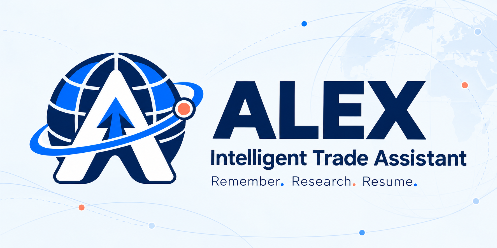
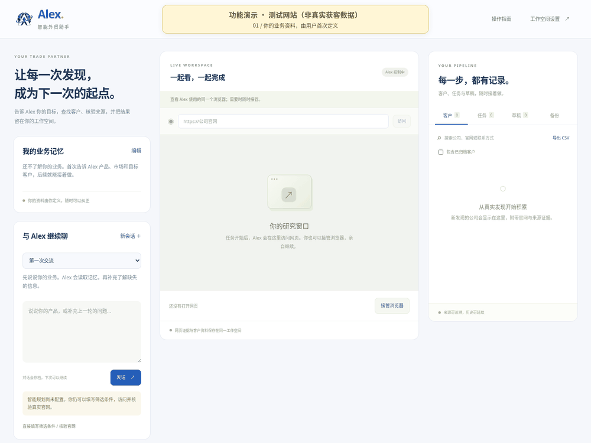
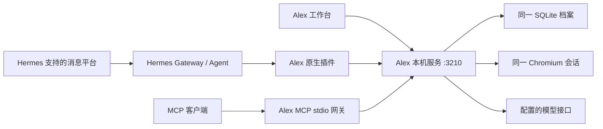

<p align="center">
  
</p>

# Alex · 智能外贸助手

**记住你的业务，研究真实客户，留下能继续工作的档案。**

Alex 是面向外贸工作的开源 Agent 工作台。它围绕用户的产品、市场和客户类型开展研究，把业务记忆、对话、客户、来源证据和任务进度保存到同一个数据库。Hermes 可作为 Agent 与消息网关，Alex 提供行业工具和客户资产；其他兼容客户端可通过标准 MCP 接入。

**v0.2 · Node.js 24.5+ · Chromium · SQLite · MIT**

[操作手册](docs/alex-user-guide.md) · [运行与部署](docs/alex-deployment.md) · [网关入口](docs/alex-gateways.md) · [优化路线](ROADMAP.md) · [验收记录](docs/alex-acceptance.md)

## 看看工作台



动图录制实际工作台和 Chromium 操作，画面始终标注“功能演示 · 测试网站”。测试公司用于展示资料保存、官网核验、证据、去重、备份和人工接管，**不计入真实获客成果**。可用 `npm run demo:record` 在临时数据目录重新录制；依赖与素材说明见 [assets](docs/assets/README.md)。

## 能做什么

| 能力 | 当前行为 |
| --- | --- |
| 多轮交流 | 历史会话与消息持久化；沿上一轮补充缺失条件，用户核对提案后启动研究 |
| 长期业务记忆 | 保存明确的资料和偏好；临时任务要求留在任务里，不推断为长期习惯 |
| 真实网页研究 | 访问实际搜索来源和公司官网，抽取 DOM、公开联系方式和引用证据 |
| 客户资产 | 稳定客户 ID、身份查重、历史证据、归档和 CSV；已归档客户仍参与查重 |
| 同一个浏览器 | 查看 Chromium 实际画面、接管、点击、输入、滚动；接管时 Agent 暂停 |
| 持续工作 | 检查点、暂停、取消、重启恢复；新进程不能同时占用同一数据目录 |
| 草稿与留档 | 基于已存证据准备开发信、人工复核、保留版本；当前没有发送渠道 |
| 备份恢复 | 在线一致性 SQLite 备份、校验和、恢复至新空目录；对话也在业务备份内 |
| Agent 入口 | Hermes 原生插件与标准 MCP stdio 网关，复用同一资料和浏览器 |

没有配置模型时，对话仍可存档，但不会生成虚构回复；结构化条件和已知官网仍可用于网页研究。打不开、无联系方式或数量不足时报告实际结果，不生成演示客户补数。

**当前是个人工作空间。** Google Maps 专用获客适配、授权海关企业交易数据、CRM、邮件/WhatsApp 外发和生产多租户尚未实现。实际来源、模型和消息平台能否使用，须按真实网络、凭据及账号权限分别验收。

## 在哪里运行

| 场景 | 推荐方案 | 访问入口 |
| --- | --- | --- |
| Linux 本机 / Windows WSL2 | Node.js + Chromium + `flock` | 本机浏览器 `http://127.0.0.1:3210` |
| Windows / macOS | Docker Desktop，按部署指南启动 | 本机映射端口 `3210` |
| 长期运行的 Linux 电脑或 VPS | 持久数据盘，systemd 或 Docker，SSH 隧道访问 | 隧道后的本机 `3210` |
| Hermes 用户 | 同机 Alex 服务 + Hermes 插件；需要时启用 Hermes 消息网关 | Hermes 对话 / 原生工作台入口 |
| 其他 Agent 客户端 | 同机 Alex 服务 + MCP stdio 进程 | 客户端工具列表 |

Codex 云环境用于开发和验证，进程不作为长期托管服务。浏览器、资料和模型调用运行在 **Alex 服务所在机器**；MCP 与 Hermes 插件是入口，不另建客户数据库。Docker 与 systemd 配置已提供，实际运行状态以[验收记录](docs/alex-acceptance.md)为准。

## Linux / WSL2 快速开始

准备 Node.js **24.5+**、Chromium 和 `flock`。浏览器不在 `/usr/bin/chromium` 时设置 `ALEX_CHROMIUM_PATH`。

```bash
npm ci
# 保留已有配置；仅首次创建。
test -e .env || cp .env.example .env
npm run doctor
npm start
```

打开 **http://127.0.0.1:3210**。在本机 `.env` 或安全的进程环境中配置模型，勿将密钥放入聊天或 Git：

```dotenv
ALEX_LLM_BASE_URL=https://api.deepseek.com/v1
ALEX_LLM_MODEL=deepseek-chat
ALEX_LLM_API_KEY=
```

默认数据位于被 Git 忽略的 `work/alex/`；`ALEX_DATA_DIR` 可指向持久磁盘。不要通过清空数据解决报错。服务只提供本机工作空间；远程访问按部署指南使用 SSH 隧道，不能直接把本机 bootstrap 暴露为公网 SaaS。

Docker、服务管理、更新、日志、备份和 SSH 的完整命令见[部署指南](docs/alex-deployment.md)。`npm run --silent doctor -- --json` 输出不含密钥的运行诊断。

## 接入什么网关



**Hermes：** 扩展对齐官方 `v2026.9.24` 的插件接口，注册 17 个行业工具和 `alex:trade-research` 技能。消息平台通过 Hermes 自己的 Gateway 配置；Alex 没有独立启动一个 Telegram、飞书或 WhatsApp Bot。见[Hermes 安装说明](integrations/hermes/README.md)与[入口选择](docs/alex-gateways.md)。

**MCP：** 标准 stdio 协议，官方 SDK 实现，提供行业工具与健康检查。客户端配置使用 `node` 和入口绝对路径，或 `npm run --silent gateway:mcp`，避免 npm 日志污染协议。先启动 Alex，再启动 MCP 网关，令牌从受保护文件内部读取。见[MCP 配置示例](integrations/mcp/README.md)。

两种入口都不提供审批、发送、数据备份恢复或抢回人工浏览器控制权的工具；任务可以从已有检查点继续。

## 第一次交流与下次继续

1. 告诉 Alex 产品、市场、客户类型与约束；它先读取已有业务记忆，再询问缺失信息。
2. 在同一会话继续补充，核对提案后点“执行此方案”；也可直接填写条件或核验已知官网。
3. 在客户详情核对来源、时间、正文引用与联系方式；需要处理网页时接管浏览器。
4. 继续历史会话或恢复原任务；归档、导出和备份客户资产。复核草稿后保留审批记录。

详细步骤、常见问题和恢复演练见[操作手册](docs/alex-user-guide.md)。

## 验证与迭代

```bash
npm test
npm run test:legacy
python integrations/hermes/test_plugin.py
npm run backup
```

`npm test` 覆盖真实 Chromium、持久化、会话、任务恢复、备份、HTTP 和官方 MCP 客户端互通。受控网页与模型替身验证工程行为，不能替代公网获客或真实模型验收；实际结果与阻断记录见[验收记录](docs/alex-acceptance.md)。

[ROADMAP.md](ROADMAP.md) 列出与 Hermes 的能力对应及每一阶段验收目标。新增来源必须有授权路径、真实提取、证据、预算、阻断状态和回归场景。贡献方式见[CONTRIBUTING.md](CONTRIBUTING.md)。

```text
apps/alex/               工作台与本机 HTTP 服务
packages/alex-core/      资料、记忆、会话、客户、证据、任务和备份
services/alex-browser/   共享 Chromium 与人工接管
services/alex-research/  真实来源研究与模型规划
services/alex-conversation/ 多轮交流与研究提案
services/alex-mcp/       标准 MCP stdio 网关
integrations/hermes/     原生行业工具、技能和 Desktop 入口
integrations/mcp/        客户端配置与集成说明
deploy/alex/             Docker / systemd 部署配置
docs/                    操作、部署、网关、架构与验收
docs/assets/             原创图标、横幅和可复现 GIF
tests/alex/              行为与集成验证
```

## 兼容与许可证

原 `packages/dsh-sdr/` 和 `app/` Python 项目保留，旧 Docker 配置仍属于旧 Python 服务；Alex 使用 `deploy/alex/`。旧离线合成数据不是 Alex 真实研究的回退路径。

MIT。请勿提交 `.env`、浏览器登录状态、真实客户数据、备份或 API key。品牌与演示素材说明见[素材说明](docs/assets/README.md)。
