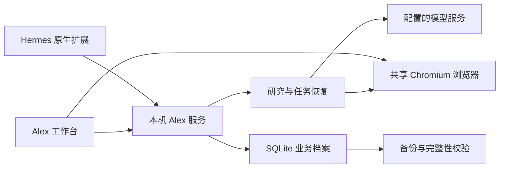

# Alex · 智能外贸助手

Alex 是一个可持续迭代的外贸 Agent 工作台：了解用户的企业和产品，保存长期业务记忆，使用真实浏览器发现和核验客户，留下客户档案、来源证据和任务进度，下次继续时读回历史并查重。

产品、市场和客户类型由用户决定。首次交流收集缺失信息，后续任务读取已存资料；一次任务的临时要求留在该任务里，不自动变成长期偏好。

## 当前版本

- 本地工作台：企业资料、长期记忆、任务、客户、证据、开发信草稿和人工复核。
- SQLite 持久保存、任务恢复检查点、可靠身份查重；归档客户仍参与查重。
- Chromium 共享会话：Agent 导航和研究，用户查看实际画面并接管；接管期间 Agent 操作被阻止。
- 真实网页研究：浏览搜索来源和实际公司网站，提取公开信息并保存来源；打不开、没有邮箱或数量不足时保留实际结果，不生成演示客户补数。
- 自然语言规划使用配置的 OpenAI 兼容模型；没有凭证时明确显示不可用。明确的结构化条件和真实官网 URL 可用于研究。
- 本地备份、完整性校验和恢复到新目录；Hermes 原生 Python 工具扩展及 Desktop 工作台入口。

这是本地单用户首版。Google Maps 专用适配、授权海关企业交易数据、CRM、邮件/WhatsApp 外发和生产多租户部署尚未实现。来源可访问范围取决于权限、网络和人工登录；不会把贸易统计当作企业交易记录。Hermes 扩展不包含模型审批、发送或获取 token 的工具。

## 启动

需要 Node.js **24.5+** 和 Chromium。Linux 已有 `/usr/bin/chromium` 时直接使用；其他位置设置 `ALEX_CHROMIUM_PATH`。浏览器安装选项及故障排查见[安装说明](docs/alex-setup.md)。

```bash
npm ci
npm start
```

打开 **http://127.0.0.1:3210**。数据默认保存在仓库忽略的 `work/alex/`，不随 Git 提交。`ALEX_DATA_DIR` 可指向持久数据盘；应用默认只绑定本机回环地址。

自然语言规划需要在环境设置或本机 `.env` 中配置 `ALEX_LLM_API_KEY`。默认 `ALEX_LLM_BASE_URL=https://api.deepseek.com/v1`、`ALEX_LLM_MODEL=deepseek-chat`，可替换为兼容模型。请勿把密钥粘贴到对话、记忆或客户档案。

## 使用流程

1. 告诉 Alex 你的产品、目标市场、客户类型和排除条件；Alex 结合历史资料拟定方案。
2. 执行真实客户研究，查看浏览器和任务记录。已有公司合并证据；打不开或信息不足时显示原因。
3. 核验客户来源，保存草稿并人工复核，导出客户 CSV。当前版本不会发送外部消息。
4. 换会话或重启后读取同一数据目录，继续保存的任务；已归档客户仍能识别。

无需按示例提前限定某个行业。提供已知的真实公司官网也可直接做证据研究；不能用编造网址代替来源发现。

## Hermes 扩展

扩展使用 Hermes **v2026.9.24** 的官方 `plugin.yaml + register(ctx)` 接口。Python 侧只需标准库；`desktop/plugin.js` 使用官方 `@hermes/plugin-sdk`，提供“打开 Alex 工作台”入口。它不是完整 Hermes 桌面分发，也没有重新构建或替换 Hermes。

安装与令牌文件配置见 [Hermes 集成说明](integrations/hermes/README.md)。业务技能见 [skills/alex/SKILL.md](skills/alex/SKILL.md)。Hermes 工具连接同一本地 Alex 服务，业务数据不依赖 Hermes 聊天上下文。

## 备份与验证

```bash
npm run backup
npm test
python integrations/hermes/test_plugin.py
npm run test:legacy
```

备份默认写入 `work/alex/backups/`。恢复命令：

```bash
node scripts/alex-backup.mjs restore <backup-directory> <new-empty-data-directory>
```

停服后由用户检查新目录，再把 `ALEX_DATA_DIR` 切换到恢复目录。备份应另存到其他磁盘或备份系统；本机副本不能防止整机或磁盘丢失。备份范围与恢复步骤见[数据管理](docs/alex-setup.md#数据与备份)。

测试中的受控网页和 HTTP fixture 只验证契约、持久化、恢复和浏览器边界；它们不算真实获客验收。外部网站、模型和付费数据服务的可用性需要在实际部署网络和凭证下验证。

首版验证结果与仍受阻的公网验收见[验收记录](docs/alex-acceptance.md)。

## 架构与目录



```text
apps/alex/              本地 HTTP 服务和工作台
packages/alex-core/     记忆、任务、客户、证据、审批与备份
services/alex-browser/  共享浏览器与接管
services/alex-research/ 真实网页研究与规划
integrations/hermes/    原生工具、打包技能与 Desktop 入口
skills/alex/            可复用的外贸业务技能
tests/alex/             行为与集成验证
packages/dsh-sdr/       保留的旧 DSH 插件
app/                   保留的旧 Python 项目
```

新增来源应实现真实提取、保存出处、预算和阻断状态，再加入固定回归场景。多租户、服务端部署和新消息渠道需分别扩展身份隔离、授权与发送幂等，当前本地工作台不宣称具备这些能力。

## 旧版兼容

原 `@xuxchloris/dsh-sdr` 插件和 `app/` Python 代码保留；旧安装方式见 [DSH 插件说明](packages/dsh-sdr/README.md)，迁移记录见 [docs/迁移方案.md](docs/迁移方案.md)。旧离线演示使用合成数据，不能作为 Alex 真实研究的回退路径。

## 许可证

MIT。请勿提交 `.env`、运行数据、浏览器登录状态、真实客户备份或 API key。
