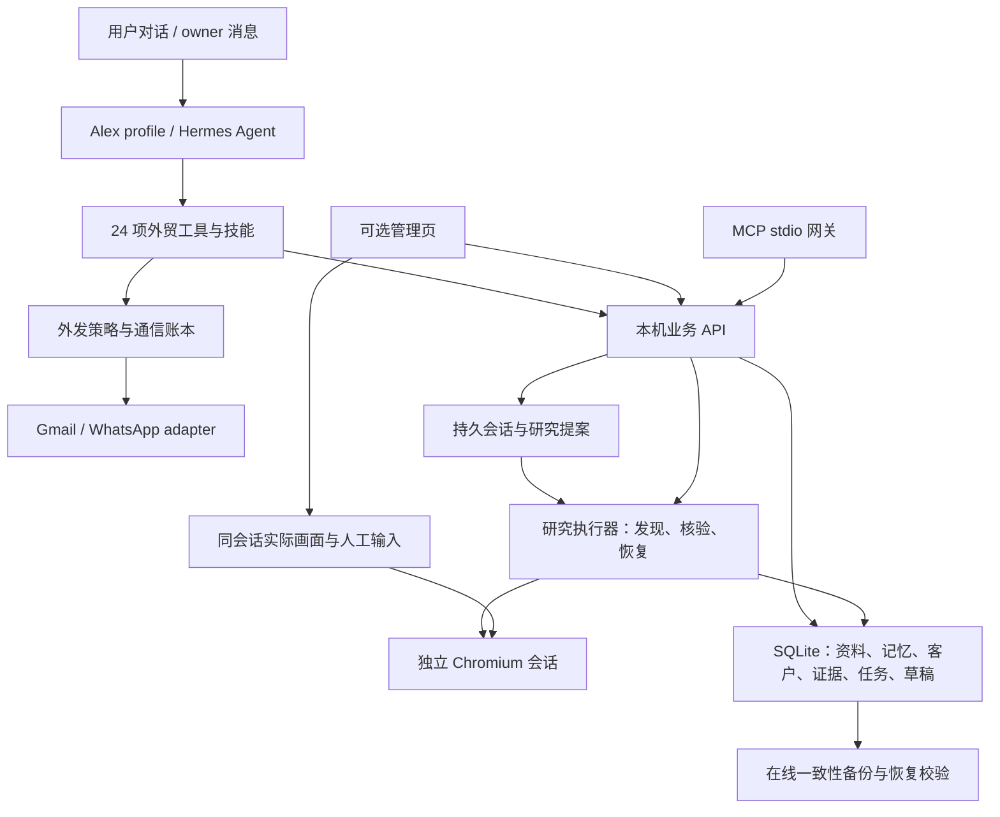

# Alex 架构与业务边界

Alex v0.3 是用户目标驱动的外贸专家 Agent，使用 Hermes 原生循环与独立 profile。产品、市场、客户类型和排除规则由真实用户提供，已有用户先读历史；不预设行业或国家。Web 页面是辅助管理入口。

## 运行结构

| 模块 | 路径 | 责任 |
| --- | --- | --- |
| Agent 发行 | `agent/`、`scripts/alex-agent.mjs` | 独立 profile、SOUL、技能、品牌、官方安装与升级、Hermes 启动 |
| 管理页面 | `apps/alex/public/` | 企业资料、客户表、来源、任务、浏览器与兼容草稿审批 |
| 本机 API | `apps/alex/server.mjs` | 本机身份、鉴权、输入验证、业务接口、备份调度 |
| 持久化核心 | `packages/alex-core/` | 事务、稳定客户 ID、去重、历史、任务检查点、审批与审计 |
| 浏览器 | `services/alex-browser/` | 真实 Chromium、页面抽取、画面、输入、控制权与公网地址限制 |
| 研究执行器 | `services/alex-research/` | 真实来源发现、官网核验与暂停恢复；旧 Web 模型规划接口保留 |
| 业务会话 | `services/alex-conversation/` | 多轮归档、上下文续接、幂等回复、明确长期资料与待执行提案 |
| MCP 网关 | `services/alex-mcp/` | 标准 stdio、19 个工具、同一本机 API 与内部令牌读取 |
| Hermes 扩展 | `integrations/hermes/` | 24 项工具：17 项业务工具与 7 项邮箱/外发工具 |
| 通信账本 | `integrations/hermes/outreach.py` | Gmail 查读、新邮件与 WhatsApp 文本外发、owner 策略、幂等尝试与退订 |
| 行业方法 | `agent/skills/` | 入门、研究、开发跟进；普通技能进入 Hermes 技能索引 |
| 兼容入口 | `packages/dsh-sdr/`、`app/` | 原有 DSH 插件与 Python 实现保留 |

## 长期记忆与客户资产

业务数据库是事实与任务进度的来源。企业资料与偏好保存历史版本，任务保存运行要求与检查点，客户保存来源观察、联系人和归档状态。Hermes 的聊天和 memory 可辅助检索，不能代替这些档案。

Hermes 对话、用户记忆和会话检索属于独立 Alex profile；结构化客户事实属于 Alex 数据库，不自动复制为 Web 对话。Agent 自己规划，按用户任务调用 `alex_task_create`，不用 `alex_plan` 再启动第二层规划。旧 Web 提案仍由用户点击执行。明确用户事实才可更新长期资料；临时或否定语境不能变成保存指令。

客户主键是稳定随机 ID。可靠来源标识和经过核验的身份关联帮助去重；补充网站不会生成新的主键。模糊同名、集团共享域名或公共邮箱不能作为无条件合并依据。归档只改变默认列表可见性，仍参与查重。

研究与联系分别控制。已有客户可补充证据或在另一产品任务中重新评估。v0.3 提供 Gmail 搜索/读取/新邮件发送和 WhatsApp 文本发送路径；Gmail 尚无同线程回复参数，Cloud 尚无主动模板路径。发送默认关闭，必须符合本机 owner 策略；旧 Web 审批不是外发授权。真实账号端到端仍未验收。

## 真实执行

真实获客链路是用户要求、来源查询、浏览器访问、实际 DOM 抽取、证据、身份匹配、客户档案。模型解释只依据已取得的材料；网页内容不得提高工具权限。

新 Alex 执行器不调用旧 `syntheticCandidates()`。真实来源不可用、验证码、权限不足或预算耗尽时保留部分结果并报告状态；不会用演示客户或猜测邮箱补足数量。

实际页面画面来自同一 Chromium 实例。界面的人为输入和研究执行器的操作使用控制权检查；接管后执行器暂停。多个研究任务串行使用浏览器，避免一个任务抽到另一个页面。

每次处理完客户即持久化结果，任务从检查点继续。外发在请求前写入 `sending`；服务商成功且返回消息 ID 才写 `sent`，不确定结果为 `unknown`，不自动重试。`sent` 是服务商接受，不是送达或已读。退订进入持久抑制名单。详见[渠道与通信](alex-channels.md)。

模型默认只获得 Alex、skills、memory、session_search 和 todo，通用执行、文件、额外消息及 cronjob 工具关闭，避免直接更改策略或绕过账本。用户可通过本机 CLI 配置 Hermes cron；owner 网关允许名单与客户收件人策略分开，尚无多客户自动客服的权限隔离路由。

## 备份

存档、导出、备份是三个能力。SQLite 在线备份包含业务数据和保存在数据库中的证据摘录，清单记录数据库校验值。恢复命令先校验 hash 和 SQLite 完整性，再恢复至空目录，禁止覆盖现有数据。

自动备份仅在服务运行期间调度；界面显示本机备份。将备份目录放在同一设备并不防设备损坏，需要用户单独配置另一设备/异地存储。浏览器 Cookie 和模型密钥不进入通用备份。

外发账本用 `npm run alex -- backup-outreach <新文件>` 单独做在线快照。完整 Agent 迁移还需停机后备份独立 Hermes profile；业务 SQLite 备份不包含完整 Hermes 会话、渠道凭据和外发账本。

## 首版部署范围

当前 Agent 是个人工作空间，业务服务绑定 loopback、使用本机令牌，不能直接作为公网团队 SaaS。企业与用户多租户登录、团队权限、云端隔离和异地备份服务仍是后续开发；已实现的渠道写入必须单独完成真实账号验收。

团队在线版建议将业务核心迁移到 PostgreSQL，保留业务 API 契约；证据文件使用对象存储，向量索引是可重建的检索层，不是客户唯一档案。

Hermes 固定参考版为 `v2026.9.24`，实际原生安装与 24 工具加载验证使用 v0.21.3 的 `db39ee3`。版本与代码证据见[源码研究](alex-hermes-study.md)。Alex 不修改上游循环；原生加载成功不等于模型、渠道账号或真实获客成功。
