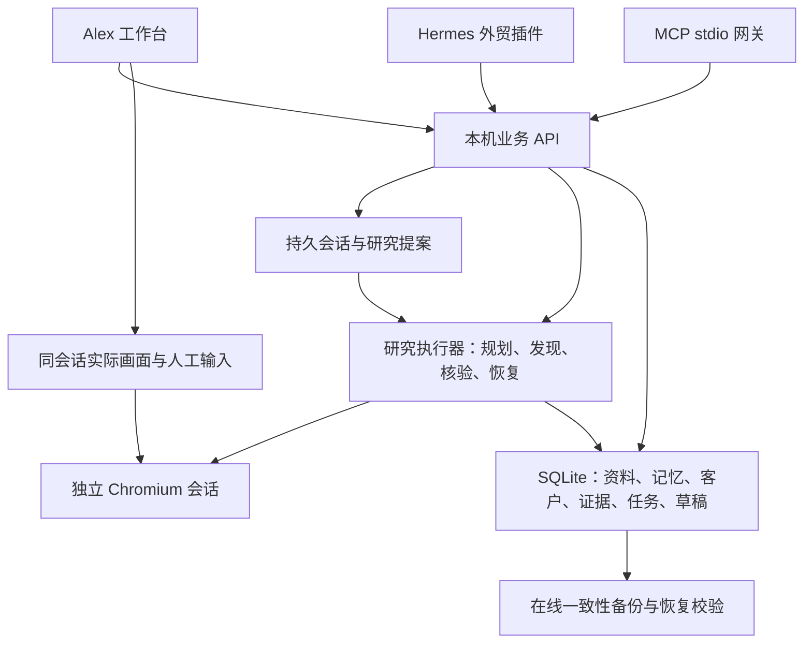

# Alex 架构与业务边界

Alex 是用户目标驱动的智能外贸助手。产品、市场、客户类型和排除规则由真实用户提供，已有用户先读历史；不预设一个行业或国家。

## 运行结构

| 模块 | 路径 | 责任 |
| --- | --- | --- |
| 工作台 | `apps/alex/public/` | 动态需求、企业资料、客户表、来源、任务、浏览器与审批 |
| 本机 API | `apps/alex/server.mjs` | 本机身份、鉴权、输入验证、业务接口、备份调度 |
| 持久化核心 | `packages/alex-core/` | 事务、稳定客户 ID、去重、历史、任务检查点、审批与审计 |
| 浏览器 | `services/alex-browser/` | 真实 Chromium、页面抽取、画面、输入、控制权与公网地址限制 |
| 研究执行器 | `services/alex-research/` | OpenAI-compatible 模型规划、真实来源发现、逐条官网核验与暂停恢复 |
| 业务会话 | `services/alex-conversation/` | 多轮归档、上下文续接、幂等回复、明确长期资料与待执行提案 |
| MCP 网关 | `services/alex-mcp/` | 标准 stdio、19 个工具、同一本机 API 与内部令牌读取 |
| Hermes 扩展 | `integrations/hermes/` | 固定接口调用 Alex 业务服务，复用 Hermes Agent |
| 行业方法 | `skills/alex/` | 长期记忆读取、来源核验、去重、结果复核的可迭代技能 |
| 兼容入口 | `packages/dsh-sdr/`、`app/` | 原有 DSH 插件与 Python 实现保留 |

## 长期记忆与客户资产

业务数据库是事实与任务进度的来源。企业资料与偏好保存历史版本，任务保存运行要求与检查点，客户保存来源观察、联系人和归档状态。Hermes 的聊天和 memory 可辅助检索，不能代替这些档案。

Web 会话和消息也保存在业务数据库；规划读取历史，但最新用户原文才可授权自动长期资料更新。临时或否定语境不能由模型裁掉前缀后变成保存指令。研究提案与执行分开，用户明确点击才创建任务。Hermes 自身平台对话仍由 Hermes 管理，不声称自动复制到 Web 会话。

客户主键是稳定随机 ID。可靠来源标识和经过核验的身份关联帮助去重；补充网站不会生成新的主键。模糊同名、集团共享域名或公共邮箱不能作为无条件合并依据。归档只改变默认列表可见性，仍参与查重。

研究与联系分别控制。已有客户可以补充新证据，也可以在用户指定的另一产品任务中重新评估；“访问过”不等于永久禁止研究。首版不提供真实邮件、WhatsApp 或 CRM 外发。

## 真实执行

真实获客链路是用户要求、来源查询、浏览器访问、实际 DOM 抽取、证据、身份匹配、客户档案。模型解释只依据已取得的材料；网页内容不得提高工具权限。

新 Alex 执行器不调用旧 `syntheticCandidates()`。真实来源不可用、验证码、权限不足或预算耗尽时保留部分结果并报告状态；不会用演示客户或猜测邮箱补足数量。

实际页面画面来自同一 Chromium 实例。界面的人为输入和研究执行器的操作使用控制权检查；接管后执行器暂停。多个研究任务串行使用浏览器，避免一个任务抽到另一个页面。

每次处理完一个客户即持久化结果。重试从检查点继续，幂等键防止同一创建请求重复任务。未来外部写入若出现“服务已执行但响应丢失”，必须核对外部结果，不能只凭本地事务保证外发一次。

## 备份

存档、导出、备份是三个能力。SQLite 在线备份包含业务数据和保存在数据库中的证据摘录，清单记录数据库校验值。恢复命令先校验 hash 和 SQLite 完整性，再恢复至空目录，禁止覆盖现有数据。

自动备份仅在服务运行期间调度；界面显示本机备份。将备份目录放在同一设备并不防设备损坏，需要用户单独配置另一设备/异地存储。浏览器 Cookie 和模型密钥不进入通用备份。

## 首版部署范围

当前工作台是本机单用户部署，绑定 loopback，API 使用本机令牌，不能直接作为公网团队 SaaS。企业与用户多租户登录、团队权限、云端隔离、对象存储、异地备份服务及正式渠道写入仍是后续开发。

团队在线版建议将业务核心迁移到 PostgreSQL，保留业务 API 契约；证据文件使用对象存储，向量索引是可重建的检索层，不是客户唯一档案。

Hermes 插件基线为 `v2026.9.24`，扩展在独立目录维护，不将 Alex 业务代码侵入 Hermes 上游循环。当前独立工作台与 Hermes Desktop 入口分开验收：适配工具可用不等于完整 Hermes 桌面端已运行。
